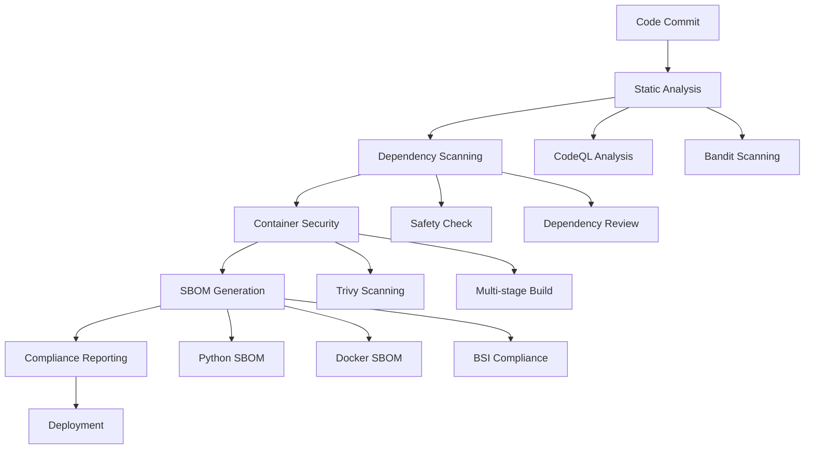
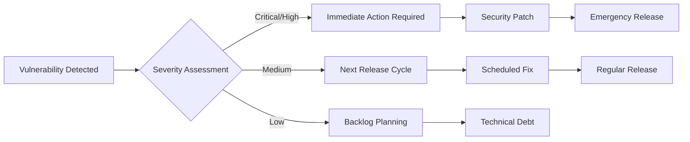

# Security & Compliance

PyBiorythm implements comprehensive security scanning and compliance measures throughout the CI/CD pipeline, including BSI TR-03183-2-2 compliant SBOM generation.

## Security Overview

Our security approach follows a **defense-in-depth strategy** with multiple layers of protection:



## CI/CD Security Pipeline

### 1. Static Code Analysis

**CodeQL Security Analysis** (`.github/workflows/codeql.yml`)
```yaml
# Runs on: Push to main/develop, PRs, weekly schedule
- Analyzes Python code for security vulnerabilities
- Detects: SQL injection, XSS, path traversal, etc.
- Results visible in GitHub Security tab
```

**Bandit Security Scanner**
```bash
# Identifies common security issues in Python code
uv run bandit -r biorythm/

# Checks for:
# - Hardcoded passwords/tokens
# - SQL injection vulnerabilities  
# - Use of insecure functions
# - Path traversal issues
```

### 2. Dependency Security

**Safety Vulnerability Scanner**
```bash
# Scans installed packages for known vulnerabilities
uv run safety check

# Database: PyUp.io vulnerability database
# Checks against: CVE, PyUp advisories
# Fails build on: High/Critical vulnerabilities
```

**Dependency Review Action**
```yaml
# GitHub's dependency-review-action
# Runs on: Pull requests
# Identifies: New vulnerabilities in dependency changes
# Blocks: PRs introducing vulnerable dependencies
```

### 3. Container Security

**Trivy Container Scanning**
```bash
# Multi-layered container security analysis
trivy image biorythm:latest

# Scans for:
# - OS package vulnerabilities
# - Application dependencies
# - Misconfigurations
# - Secrets in container layers
```

**Secure Container Build**
```dockerfile
# Multi-stage build for minimal attack surface
FROM python:3.12-slim as builder
# Build dependencies installed here

FROM python:3.12-slim as production  
# Only runtime components
RUN groupadd -r biorythm && useradd -r -g biorythm biorythm
USER biorythm  # Non-root execution
```

## Software Bill of Materials (SBOM)

### BSI TR-03183-2-2 Compliance

PyBiorythm generates **BSI TR-03183-2-2** compliant SBOMs as required by German cybersecurity standards.

**SBOM Generation Workflow** (`.github/workflows/sbom.yml`)

#### Python Dependencies SBOM
```bash
# Generate requirements freeze
uv pip freeze > requirements-freeze.txt

# Create CycloneDX SBOM (BSI compliant format)
cyclonedx-py requirements requirements-freeze.txt \
  --output-format json \
  --output-file sbom-python.json
```

#### Docker Container SBOM
```bash
# Generate container SBOM with Trivy
trivy image --format cyclonedx \
  --output sbom-container.json \
  biorythm:latest
```

#### Combined SBOM
```bash
# Merge Python and container SBOMs
# Include metadata, checksums, and provenance
# Generate final BSI-compliant artifact
```

### SBOM Contents

Each SBOM includes:

| Component | BSI Requirement | Implementation |
|-----------|-----------------|----------------|
| **Component Inventory** | ✅ Required | All dependencies with versions |
| **Vulnerability Data** | ✅ Required | CVE mappings from safety/trivy |
| **License Information** | ✅ Required | SPDX license identifiers |
| **Supplier Information** | ✅ Required | Package maintainer details |
| **Integrity Hashes** | ✅ Required | SHA-512 checksums |
| **Provenance Data** | ✅ Required | Build environment metadata |
| **Relationship Mapping** | ✅ Required | Dependency relationships |

### SBOM Artifacts

**Generated Artifacts:**
```
artifacts/
├── sbom-python.json          # Python dependencies
├── sbom-container.json        # Container components  
├── sbom-combined.json         # Merged SBOM
├── sbom-validation.json       # BSI compliance report
└── vulnerability-report.json   # Security assessment
```

**Artifact Retention:**
- **SBOM Files**: 365 days (compliance requirement)
- **Vulnerability Reports**: 90 days
- **Build Metadata**: 30 days

### BSI Compliance Features

✅ **CycloneDX Format**: Industry standard, BSI approved  
✅ **Component Identification**: Unique identifiers (PURL/CPE)  
✅ **Vulnerability Correlation**: CVE to component mapping  
✅ **License Compliance**: SPDX license identification  
✅ **Integrity Verification**: Cryptographic hashes  
✅ **Build Reproducibility**: Environment fingerprinting  
✅ **Supply Chain Transparency**: Full dependency tree  

## Security Reporting & Monitoring

### GitHub Security Tab

All security findings are integrated with **GitHub's Security tab**:

1. **Code Scanning Alerts**: CodeQL findings
2. **Dependency Alerts**: Vulnerable dependencies
3. **Secret Scanning**: Accidental credential exposure
4. **Security Overview**: Risk assessment dashboard

**Access**: `https://github.com/dkdndes/pybiorythm/security`

### Vulnerability Management Process



### Security Metrics

**Current Security Posture:**

| Metric | Status | Target |
|--------|---------|---------|
| **Critical Vulnerabilities** | 0 | 0 |
| **High Vulnerabilities** | 0 | 0 |
| **Medium Vulnerabilities** | 0 | ≤ 5 |
| **Dependency Freshness** | 99% current | > 95% |
| **Security Coverage** | 100% scanned | 100% |
| **SBOM Compliance** | BSI TR-03183-2-2 | Maintain |

## Container Security Hardening

### Production Container Features

**Security Hardening:**
```dockerfile
# Distroless/slim base images
FROM python:3.12-slim

# Non-root user execution
RUN groupadd -r biorythm && useradd -r -g biorythm biorythm
USER biorythm

# Minimal attack surface
# No shell, package managers, or dev tools in production

# Read-only filesystem where possible
# Security labels and capabilities
```

**Runtime Security:**
```bash
# Container scanning before deployment
docker run --security-opt=no-new-privileges \
           --cap-drop=ALL \
           --read-only \
           biorythm:latest
```

### Multi-Architecture Security

**Platform Support:**
- **AMD64**: Intel/AMD processors
- **ARM64**: Apple Silicon, AWS Graviton

**Security Implications:**
- Separate vulnerability assessments per architecture
- Architecture-specific SBOMs
- Cross-compilation security validation

## Secrets Management

### Environment Secrets

**Production Secrets:**
```yaml
secrets:
  GITHUB_TOKEN: ${{ secrets.GITHUB_TOKEN }}
  CODECOV_TOKEN: ${{ secrets.CODECOV_TOKEN }}
  DOCKER_PASSWORD: ${{ secrets.DOCKER_PASSWORD }}
```

**Security Measures:**
- ✅ No secrets in code or logs
- ✅ Encrypted storage (GitHub Secrets)
- ✅ Least-privilege access
- ✅ Regular rotation scheduling
- ✅ Secret scanning enabled

### Local Development

**Local Secrets (.secrets file):**
```bash
# Never commit real secrets
GITHUB_TOKEN=dummy_token_for_testing
DOCKER_PASSWORD=dummy_password

# Add to .gitignore
echo ".secrets" >> .gitignore
```

## Compliance & Auditing

### BSI TR-03183-2-2 Requirements

**Technical Requirements:**
- [x] **SBOM Generation**: CycloneDX format
- [x] **Component Identification**: PURL/CPE identifiers  
- [x] **Vulnerability Assessment**: CVE correlation
- [x] **License Compliance**: SPDX identification
- [x] **Integrity Verification**: SHA-512 hashes
- [x] **Supply Chain Documentation**: Full dependency tree
- [x] **Automated Generation**: CI/CD integration
- [x] **Retention Policy**: 365-day minimum

**Process Requirements:**
- [x] **Continuous Monitoring**: Every build generates SBOM
- [x] **Vulnerability Response**: Documented process
- [x] **Access Control**: Secured artifact storage
- [x] **Audit Trail**: Complete build provenance
- [x] **Documentation**: Compliance procedures

### Audit Artifacts

**Available for Compliance Audits:**
```
audit-trail/
├── sbom-history/              # Historical SBOMs
├── vulnerability-reports/     # Security assessments  
├── build-provenance/         # Build environment data
├── dependency-changes/       # Dependency evolution
└── security-responses/       # Incident responses
```

## Security Monitoring & Alerting

### Automated Monitoring

**GitHub Actions Integration:**
- **Daily**: Dependency vulnerability scans
- **Weekly**: Deep security analysis (CodeQL)
- **Per-Commit**: Static analysis and secret scanning
- **Per-Release**: Complete SBOM generation

### Alert Channels

**Security Alerts:**
- **GitHub Security Tab**: Primary dashboard
- **Email Notifications**: Critical vulnerabilities
- **PR Comments**: Dependency review findings
- **Build Failures**: Security scan failures

## Incident Response

### Security Vulnerability Response

**Response Timeline:**
- **Critical (CVSS 9.0-10.0)**: 24 hours
- **High (CVSS 7.0-8.9)**: 72 hours  
- **Medium (CVSS 4.0-6.9)**: 2 weeks
- **Low (CVSS 0.1-3.9)**: Next release cycle

**Response Process:**
1. **Assessment**: Impact and exploitability analysis
2. **Patch Development**: Security fix implementation
3. **Testing**: Security regression testing
4. **Release**: Emergency or scheduled release
5. **Communication**: Security advisory publication
6. **SBOM Update**: Updated compliance artifacts

### Emergency Procedures

**Critical Security Issue:**
```bash
# 1. Immediate assessment
git checkout -b security/CVE-XXXX-XXXXX

# 2. Apply security patch
# (implement fix)

# 3. Security testing
uv run pytest tests/security/
uv run bandit -r biorythm/
uv run safety check

# 4. Emergency release
git commit -m "security: fix CVE-XXXX-XXXXX critical vulnerability"
git push origin security/CVE-XXXX-XXXXX
# Create emergency PR and release
```

## Security Configuration

### GitHub Repository Security

**Enabled Security Features:**
- [x] **Private Vulnerability Reporting**: Coordinated disclosure
- [x] **Dependency Graph**: Vulnerability tracking
- [x] **Dependabot Alerts**: Automated vulnerability detection
- [x] **Dependabot Security Updates**: Automated patching
- [x] **Code Scanning**: CodeQL integration
- [x] **Secret Scanning**: Credential leak prevention
- [x] **Push Protection**: Prevents secret commits

### Branch Protection

**Main Branch Security:**
- [x] **Required Reviews**: Minimum 1 reviewer
- [x] **Dismiss Stale Reviews**: On new commits
- [x] **Required Status Checks**: All security scans must pass
- [x] **Up-to-date Branches**: Must be current with main
- [x] **Administrator Enforcement**: No bypass privileges

## Resources & References

### Standards & Guidelines

- **BSI TR-03183-2-2**: Software Bill of Materials
- **NIST SSDF**: Secure Software Development Framework  
- **OWASP SAMM**: Software Assurance Maturity Model
- **CycloneDX**: SBOM standard specification
- **SPDX**: License identification standard

### Tools & Integration

- **CodeQL**: GitHub's semantic code analysis
- **Trivy**: Container vulnerability scanner
- **Bandit**: Python security linter  
- **Safety**: Python dependency vulnerability checker
- **CycloneDX**: SBOM generation toolkit

### Monitoring & Dashboards

- **GitHub Security Tab**: https://github.com/dkdndes/pybiorythm/security
- **Dependabot Alerts**: Automated vulnerability notifications  
- **Actions Logs**: Security scan execution history
- **Artifact Storage**: SBOM and compliance reports

---

**Next Steps:**
- [CI/CD Pipeline Overview](../workflows/github-actions.md)
- [Local Security Testing](local-github-actions.md)
- [Docker Security](docker.md)
- [Dependency Management](../developer-guide/setup.md)