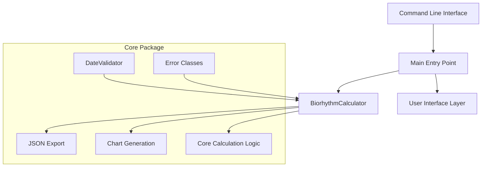
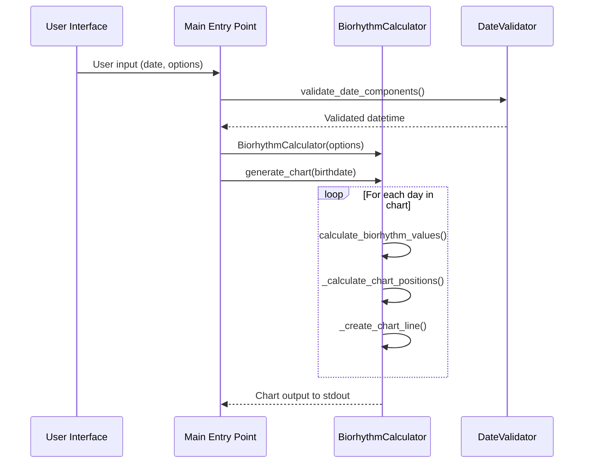
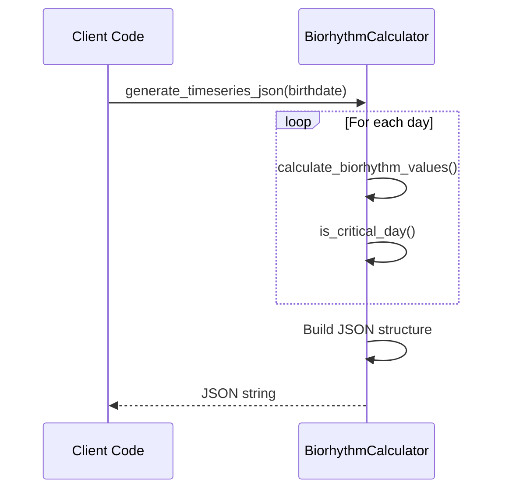

# PyBiorythm Architecture

This document describes the architecture and design patterns of the PyBiorythm project, providing insights for developers who want to understand, maintain, or extend the codebase.

## Project Overview

PyBiorythm is a Python library that implements biorhythm calculations and visualizations. The project is designed with modularity, scientific disclaimers, and multiple output formats in mind.

**Important Note**: This project implements pseudoscientific biorhythm theory for entertainment purposes only. All calculations are mathematically correct implementations of the biorhythm theory, but the theory itself has no scientific validity.

## Project Structure

```
biorythm/
├── biorythm/                 # Main package
│   ├── __init__.py          # Package initialization and exports
│   └── core.py              # Core biorhythm calculation logic
├── main.py                  # Command-line interface entry point
├── tests/                   # Test suite
│   ├── __init__.py
│   ├── conftest.py          # Test configuration and fixtures
│   ├── test_biorhythm_calculator.py
│   ├── test_biorythm_coverage.py
│   ├── test_json_timeseries.py
│   └── test_main.py
├── docs/                    # Documentation
├── docker/                  # Container configurations
├── k8s-deployment.yaml      # Kubernetes deployment
└── pyproject.toml          # Build configuration
```

## Core Architecture

### Module Design

The architecture follows a layered approach with clear separation of concerns:



### Class Hierarchy

#### BiorhythmCalculator (Main Class)
- **Responsibility**: Primary interface for biorhythm operations
- **Key Methods**:
  - `calculate_biorhythm_values()`: Core mathematical calculations
  - `generate_chart()`: ASCII chart generation
  - `generate_timeseries_json()`: JSON data export
- **Dependencies**: DateValidator, UserInterface
- **Design Pattern**: Facade pattern - provides simplified interface to complex calculations

#### DateValidator (Utility Class)
- **Responsibility**: Date validation and creation
- **Key Methods**:
  - `validate_date_components()`: Validates year, month, day
  - `create_validated_date()`: Creates datetime objects with validation
- **Design Pattern**: Static methods for utility functions

#### UserInterface (UI Class)
- **Responsibility**: Interactive user input collection
- **Key Methods**:
  - `get_user_input()`: Collect user input with validation
- **Design Pattern**: Single responsibility for UI concerns

#### Exception Classes
Custom exception hierarchy for better error handling:
- `BiorhythmError`: Base exception
- `DateValidationError`: Date-related errors
- `ChartParameterError`: Chart configuration errors

## Design Patterns

### 1. Facade Pattern
The `BiorhythmCalculator` class acts as a facade, providing a simple interface to complex biorhythm calculations, chart generation, and data export functionality.

```python
# Simple interface hides complex operations
calc = BiorhythmCalculator()
calc.generate_chart(birthdate)  # Internally handles validation, calculation, formatting
```

### 2. Strategy Pattern
Different chart orientations are handled through strategy-like methods:
- `_generate_vertical_chart()`: Traditional top-to-bottom timeline
- `_create_combined_horizontal_wave_matrix()`: Left-to-right wave visualization

### 3. Template Method Pattern
Chart generation follows a template with customizable steps:
1. Header generation
2. Data calculation 
3. Chart rendering
4. Footer/summary

### 4. Factory Pattern
Date creation and validation is centralized through static factory methods in `DateValidator`.

## Key Architectural Decisions

### 1. Mathematical Accuracy
The biorhythm calculations use standard sine wave formulas with exact cycle periods:
- Physical: 23 days
- Emotional: 28 days  
- Intellectual: 33 days

```python
# Core calculation (simplified)
physical = math.sin((2 * math.pi * days_alive) / PHYSICAL_CYCLE_DAYS)
```

### 2. Multiple Output Formats
The architecture supports multiple output formats through method overloading:
- ASCII charts (vertical/horizontal)
- JSON data export
- Structured logging

### 3. Scientific Disclaimers
Extensive disclaimers are embedded throughout:
- Module docstrings
- Class initialization
- Chart headers
- JSON metadata

### 4. Input Validation
Comprehensive validation at multiple layers:
- Date validation (past dates only)
- Parameter validation (positive integers)
- Type checking (datetime objects)

### 5. Error Handling
Structured exception hierarchy with specific error types for different failure modes.

## Data Flow

### Chart Generation Flow


### JSON Generation Flow


## Critical Days Detection

The architecture includes sophisticated critical day detection:

```python
def is_critical_day(self, physical, emotional, intellectual):
    """Detect when cycles are near zero (traditionally considered risky)"""
    critical_cycles = []
    if abs(physical) <= CRITICAL_DAY_THRESHOLD:
        critical_cycles.append("Physical")
    # ... similar for other cycles
    return len(critical_cycles) > 0, critical_cycles
```

## Performance Considerations

### 1. Calculation Efficiency
- Sine calculations are performed only once per day per cycle
- No caching is needed due to the simplicity of sine functions
- Memory usage is minimal (no large data structures)

### 2. Chart Generation Optimization
- String concatenation is minimized through list-based building
- Chart width is configurable to balance readability vs. terminal width
- Critical day detection uses early exit conditions

### 3. Scalability
- Thread-safe for read operations
- No shared mutable state between instances
- Suitable for concurrent execution

## Extension Points

### 1. New Chart Formats
To add new visualization formats:
1. Create new method in `BiorhythmCalculator`
2. Follow template method pattern
3. Add orientation validation

### 2. Additional Cycles
To add new biorhythm cycles:
1. Define cycle length constant
2. Add calculation in `calculate_biorhythm_values()`
3. Update chart generation methods
4. Update JSON schema

### 3. Export Formats
To add new export formats:
1. Create new generation method
2. Define output schema
3. Add command-line option
4. Update documentation

## Testing Architecture

### Test Structure
- `conftest.py`: Shared fixtures and configuration
- Individual test files for each major component
- Integration tests for end-to-end workflows
- Coverage testing for comprehensive validation

### Test Categories
1. **Unit Tests**: Individual method testing
2. **Integration Tests**: Component interaction
3. **Edge Case Tests**: Boundary conditions
4. **Performance Tests**: Calculation speed validation

## Logging and Observability

### Logging Strategy
- Structured logging with different levels
- Performance metrics for large calculations
- Error tracking with contextual information
- Debug information for troubleshooting

```python
self.logger.info(f"BiorhythmCalculator initialized: width={self.width}")
self.logger.debug(f"Calculating biorhythm for {days_alive} days since birth")
self.logger.error(f"Error generating chart: {str(e)}")
```

## Configuration Management

### Environment-Based Configuration
- Development vs. production settings
- Logging levels
- Chart default parameters
- Validation strictness

### Runtime Configuration
- Command-line argument parsing
- Interactive input validation
- Default parameter management

## Security Considerations

### Input Validation
- All user inputs are validated before processing
- Date ranges are restricted to valid historical dates
- Numeric inputs are bounded to reasonable ranges

### Data Privacy
- No personal data is stored or transmitted
- All calculations are performed locally
- No external API calls or data sharing

## Future Architecture Considerations

### Potential Enhancements
1. **Plugin Architecture**: Support for custom cycle definitions
2. **REST API**: Web service interface
3. **Database Storage**: Historical calculation caching
4. **Real-time Updates**: Live chart updates
5. **Multiple Output Formats**: PDF, SVG, PNG generation

### Scalability Improvements
1. **Batch Processing**: Multiple birthdate calculations
2. **Caching Layer**: Pre-computed cycle values
3. **Async Processing**: Non-blocking calculations
4. **Distributed Computing**: Cluster-based calculations

---

**Next**: [Testing](testing.md) | [Code Quality](code-quality.md) | [Contributing](contributing.md)