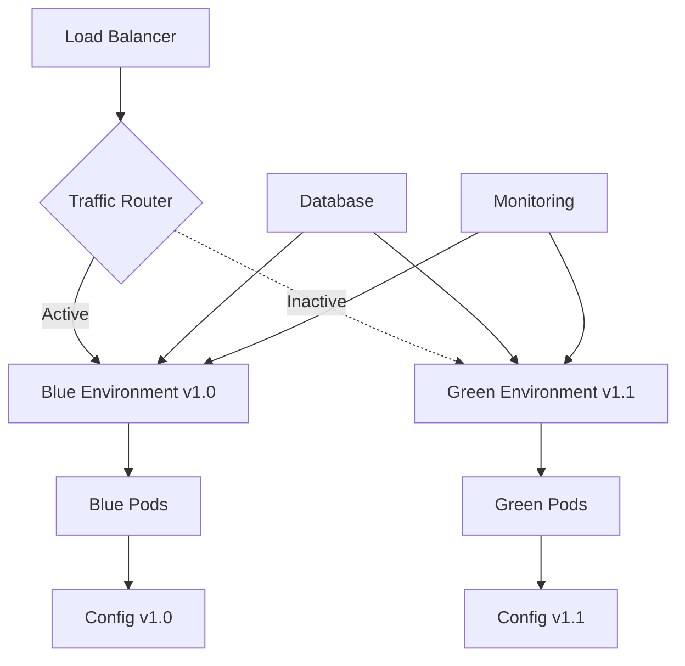

# Blue-Green Deployment Workflow

This document describes how to implement blue-green deployment strategies for PyBiorythm applications, ensuring zero-downtime deployments and safe rollbacks.

!!! warning "Demonstration Implementation"
    **This blue-green deployment workflow is a demonstration** of enterprise deployment patterns. PyBiorythm is a **CLI application** that doesn't require load balancing or zero-downtime deployments.
    
    **Real PyBiorythm deployments** use:
    - **Kubernetes Jobs** for batch processing
    - **CronJobs** for scheduled chart generation  
    - **Interactive pods** for development
    
    The HTTP server patterns, health endpoints, and traffic switching shown here **demonstrate production deployment techniques** for web applications.

## Overview

Blue-green deployment is a technique that reduces downtime and risk by running two identical production environments called Blue and Green. At any time, only one of the environments is live, serving all production traffic.

**Benefits for PyBiorythm deployments:**
- **Zero-downtime deployments** - Users experience no service interruption
- **Instant rollbacks** - Switch back to previous version immediately if issues arise
- **Testing in production** - Test new version with production data before switching traffic
- **Risk reduction** - Minimize impact of deployment failures

## Deployment Architecture

### Environment Setup



### Infrastructure Components

1. **Load Balancer/Ingress**: Routes traffic between blue and green environments
2. **Blue Environment**: Currently active production environment
3. **Green Environment**: Staging environment for new deployments
4. **Database**: Shared between environments (with migration strategy)
5. **Monitoring**: Tracks health and performance of both environments

## Kubernetes Implementation

### Base Configuration

#### Namespace Setup

```yaml
# namespaces.yaml
apiVersion: v1
kind: Namespace
metadata:
  name: pybiorythm-blue
  labels:
    environment: production
    color: blue
---
apiVersion: v1
kind: Namespace
metadata:
  name: pybiorythm-green
  labels:
    environment: production
    color: green
```

#### Blue Environment Deployment

```yaml
# blue-deployment.yaml
apiVersion: apps/v1
kind: Deployment
metadata:
  name: pybiorythm-blue
  namespace: pybiorythm-blue
  labels:
    app: pybiorythm
    version: v1.0.0
    environment: blue
spec:
  replicas: 3
  selector:
    matchLabels:
      app: pybiorythm
      environment: blue
  template:
    metadata:
      labels:
        app: pybiorythm
        environment: blue
        version: v1.0.0
    spec:
      containers:
      - name: pybiorythm
        image: your-registry/pybiorythm:v1.0.0
        ports:
        - containerPort: 8080
        env:
        - name: ENVIRONMENT
          value: "blue"
        - name: VERSION
          value: "v1.0.0"
        - name: PYTHONUNBUFFERED
          value: "1"
        resources:
          requests:
            memory: "512Mi"
            cpu: "500m"
          limits:
            memory: "1Gi"
            cpu: "1000m"
        livenessProbe:
          httpGet:
            path: /health
            port: 8080
          initialDelaySeconds: 30
          periodSeconds: 10
        readinessProbe:
          httpGet:
            path: /ready
            port: 8080
          initialDelaySeconds: 5
          periodSeconds: 5
---
apiVersion: v1
kind: Service
metadata:
  name: pybiorythm-blue-service
  namespace: pybiorythm-blue
  labels:
    app: pybiorythm
    environment: blue
spec:
  selector:
    app: pybiorythm
    environment: blue
  ports:
  - port: 80
    targetPort: 8080
    protocol: TCP
  type: ClusterIP
```

#### Green Environment Deployment

```yaml
# green-deployment.yaml
apiVersion: apps/v1
kind: Deployment
metadata:
  name: pybiorythm-green
  namespace: pybiorythm-green
  labels:
    app: pybiorythm
    version: v1.1.0
    environment: green
spec:
  replicas: 3
  selector:
    matchLabels:
      app: pybiorythm
      environment: green
  template:
    metadata:
      labels:
        app: pybiorythm
        environment: green
        version: v1.1.0
    spec:
      containers:
      - name: pybiorythm
        image: your-registry/pybiorythm:v1.1.0
        ports:
        - containerPort: 8080
        env:
        - name: ENVIRONMENT
          value: "green"
        - name: VERSION
          value: "v1.1.0"
        - name: PYTHONUNBUFFERED
          value: "1"
        resources:
          requests:
            memory: "512Mi"
            cpu: "500m"
          limits:
            memory: "1Gi"
            cpu: "1000m"
        livenessProbe:
          httpGet:
            path: /health
            port: 8080
          initialDelaySeconds: 30
          periodSeconds: 10
        readinessProbe:
          httpGet:
            path: /ready
            port: 8080
          initialDelaySeconds: 5
          periodSeconds: 5
---
apiVersion: v1
kind: Service
metadata:
  name: pybiorythm-green-service
  namespace: pybiorythm-green
  labels:
    app: pybiorythm
    environment: green
spec:
  selector:
    app: pybiorythm
    environment: green
  ports:
  - port: 80
    targetPort: 8080
    protocol: TCP
  type: ClusterIP
```

### Traffic Routing

#### Ingress Configuration

```yaml
# ingress.yaml
apiVersion: networking.k8s.io/v1
kind: Ingress
metadata:
  name: pybiorythm-ingress
  namespace: pybiorythm-blue  # Initially points to blue
  annotations:
    nginx.ingress.kubernetes.io/rewrite-target: /
    nginx.ingress.kubernetes.io/ssl-redirect: "true"
    cert-manager.io/cluster-issuer: "letsencrypt-prod"
spec:
  tls:
  - hosts:
    - api.pybiorythm.example.com
    secretName: pybiorythm-tls
  rules:
  - host: api.pybiorythm.example.com
    http:
      paths:
      - path: /
        pathType: Prefix
        backend:
          service:
            name: pybiorythm-blue-service
            port:
              number: 80
```

#### Service with Selector Switching

```yaml
# main-service.yaml
apiVersion: v1
kind: Service
metadata:
  name: pybiorythm-main
  namespace: default
  labels:
    app: pybiorythm
spec:
  selector:
    app: pybiorythm
    environment: blue  # Switch between 'blue' and 'green'
  ports:
  - port: 80
    targetPort: 8080
    protocol: TCP
  type: LoadBalancer
```

## Deployment Automation Scripts

### Blue-Green Switch Script

```bash
#!/bin/bash
# blue-green-switch.sh

set -e

CURRENT_ENV=""
TARGET_ENV=""
NAMESPACE_BLUE="pybiorythm-blue"
NAMESPACE_GREEN="pybiorythm-green"
SERVICE_NAME="pybiorythm-main"
INGRESS_NAME="pybiorythm-ingress"

# Functions
get_current_environment() {
    CURRENT_ENV=$(kubectl get service $SERVICE_NAME -o jsonpath='{.spec.selector.environment}' 2>/dev/null || echo "")
    if [ -z "$CURRENT_ENV" ]; then
        echo "Warning: Could not determine current environment. Assuming blue."
        CURRENT_ENV="blue"
    fi
    echo "Current environment: $CURRENT_ENV"
}

determine_target_environment() {
    if [ "$CURRENT_ENV" = "blue" ]; then
        TARGET_ENV="green"
    else
        TARGET_ENV="blue"
    fi
    echo "Target environment: $TARGET_ENV"
}

check_target_environment_health() {
    echo "Checking health of $TARGET_ENV environment..."
    
    TARGET_NAMESPACE="pybiorythm-$TARGET_ENV"
    
    # Check if deployment exists and is ready
    if ! kubectl get deployment pybiorythm-$TARGET_ENV -n $TARGET_NAMESPACE >/dev/null 2>&1; then
        echo "Error: Deployment pybiorythm-$TARGET_ENV not found in namespace $TARGET_NAMESPACE"
        exit 1
    fi
    
    # Wait for deployment to be ready
    echo "Waiting for $TARGET_ENV deployment to be ready..."
    kubectl wait --for=condition=available --timeout=300s deployment/pybiorythm-$TARGET_ENV -n $TARGET_NAMESPACE
    
    # Check pod readiness
    READY_PODS=$(kubectl get pods -n $TARGET_NAMESPACE -l environment=$TARGET_ENV --field-selector=status.phase=Running | grep -c "Running" || echo "0")
    TOTAL_PODS=$(kubectl get pods -n $TARGET_NAMESPACE -l environment=$TARGET_ENV --no-headers | wc -l)
    
    echo "Ready pods in $TARGET_ENV: $READY_PODS/$TOTAL_PODS"
    
    if [ "$READY_PODS" -eq 0 ]; then
        echo "Error: No ready pods found in $TARGET_ENV environment"
        exit 1
    fi
    
    # CLI health check (adapted for demonstration)
    echo "Performing CLI health check..."
    
    # Test CLI application functionality
    CLI_TEST=$(kubectl exec -n $TARGET_NAMESPACE deployment/pybiorythm-$TARGET_ENV -- python -c "import biorythm; print('OK')" 2>/dev/null || echo "FAILED")
    
    if [ "$CLI_TEST" != "OK" ]; then
        echo "Error: CLI health check failed"
        exit 1
    fi
    
    # Test biorhythm calculation
    CALC_TEST=$(kubectl exec -n $TARGET_NAMESPACE deployment/pybiorythm-$TARGET_ENV -- python main.py -y 1990 -m 5 -d 15 >/dev/null 2>&1 && echo "OK" || echo "FAILED")
    
    if [ "$CALC_TEST" != "OK" ]; then
        echo "Error: Biorhythm calculation test failed"
        exit 1
    fi
    
    echo "✓ $TARGET_ENV environment is healthy"
}

switch_traffic() {
    echo "Switching traffic from $CURRENT_ENV to $TARGET_ENV..."
    
    # Update main service selector
    kubectl patch service $SERVICE_NAME -p "{\"spec\":{\"selector\":{\"environment\":\"$TARGET_ENV\"}}}"
    
    # Update ingress if it exists
    TARGET_NAMESPACE="pybiorythm-$TARGET_ENV"
    if kubectl get ingress $INGRESS_NAME -n pybiorythm-$CURRENT_ENV >/dev/null 2>&1; then
        # Delete old ingress
        kubectl delete ingress $INGRESS_NAME -n pybiorythm-$CURRENT_ENV
        
        # Create new ingress in target namespace
        kubectl patch ingress $INGRESS_NAME -n $TARGET_NAMESPACE -p "{\"spec\":{\"rules\":[{\"host\":\"api.pybiorythm.example.com\",\"http\":{\"paths\":[{\"path\":\"/\",\"pathType\":\"Prefix\",\"backend\":{\"service\":{\"name\":\"pybiorythm-$TARGET_ENV-service\",\"port\":{\"number\":80}}}}]}}]}}"
    fi
    
    echo "✓ Traffic switched to $TARGET_ENV environment"
}

verify_switch() {
    echo "Verifying traffic switch..."
    sleep 10
    
    # Check service endpoints
    ENDPOINTS=$(kubectl get endpoints $SERVICE_NAME -o jsonpath='{.subsets[*].addresses[*].ip}' | wc -w)
    echo "Active endpoints: $ENDPOINTS"
    
    if [ "$ENDPOINTS" -eq 0 ]; then
        echo "Warning: No active endpoints found"
    fi
    
    # Test external connectivity
    EXTERNAL_IP=$(kubectl get service $SERVICE_NAME -o jsonpath='{.status.loadBalancer.ingress[0].ip}')
    if [ -n "$EXTERNAL_IP" ]; then
        HTTP_STATUS=$(curl -s -o /dev/null -w "%{http_code}" http://$EXTERNAL_IP/health || echo "000")
        if [ "$HTTP_STATUS" = "200" ]; then
            echo "✓ External health check passed"
        else
            echo "Warning: External health check failed. HTTP status: $HTTP_STATUS"
        fi
    fi
    
    echo "✓ Traffic switch verification completed"
}

rollback() {
    echo "Rolling back to $CURRENT_ENV environment..."
    kubectl patch service $SERVICE_NAME -p "{\"spec\":{\"selector\":{\"environment\":\"$CURRENT_ENV\"}}}"
    echo "✓ Rollback completed"
}

# Main execution
main() {
    echo "=== PyBiorythm Blue-Green Deployment Switch ==="
    
    get_current_environment
    determine_target_environment
    
    echo ""
    echo "This will switch traffic from $CURRENT_ENV to $TARGET_ENV environment."
    read -p "Do you want to continue? (y/N): " -n 1 -r
    echo ""
    
    if [[ ! $REPLY =~ ^[Yy]$ ]]; then
        echo "Deployment cancelled."
        exit 0
    fi
    
    check_target_environment_health
    switch_traffic
    verify_switch
    
    echo ""
    echo "=== Deployment Complete ==="
    echo "Traffic is now routed to: $TARGET_ENV"
    echo "Previous environment ($CURRENT_ENV) is still running and can be used for rollback."
    echo ""
    echo "To rollback, run: kubectl patch service $SERVICE_NAME -p '{\"spec\":{\"selector\":{\"environment\":\"$CURRENT_ENV\"}}}'"
}

# Handle script arguments
case "${1:-}" in
    "rollback")
        get_current_environment
        if [ "$CURRENT_ENV" = "blue" ]; then
            rollback_target="green"
        else
            rollback_target="blue"
        fi
        echo "Rolling back to $rollback_target environment..."
        kubectl patch service $SERVICE_NAME -p "{\"spec\":{\"selector\":{\"environment\":\"$rollback_target\"}}}"
        echo "✓ Rollback completed"
        ;;
    "status")
        get_current_environment
        echo "Current active environment: $CURRENT_ENV"
        kubectl get pods -n pybiorythm-blue -l app=pybiorythm
        kubectl get pods -n pybiorythm-green -l app=pybiorythm
        ;;
    "health")
        echo "Checking health of both environments..."
        kubectl get pods -n pybiorythm-blue -l app=pybiorythm
        kubectl get pods -n pybiorythm-green -l app=pybiorythm
        ;;
    *)
        main
        ;;
esac
```

### Deployment Script

```bash
#!/bin/bash
# deploy-blue-green.sh

set -e

VERSION=${1:-"latest"}
ENVIRONMENT=${2:-"auto"}  # auto, blue, green
IMAGE_REGISTRY=${IMAGE_REGISTRY:-"your-registry"}
IMAGE_NAME="$IMAGE_REGISTRY/pybiorythm:$VERSION"

if [ "$ENVIRONMENT" = "auto" ]; then
    # Determine target environment automatically
    CURRENT_ENV=$(kubectl get service pybiorythm-main -o jsonpath='{.spec.selector.environment}' 2>/dev/null || echo "blue")
    if [ "$CURRENT_ENV" = "blue" ]; then
        TARGET_ENV="green"
    else
        TARGET_ENV="blue"
    fi
else
    TARGET_ENV=$ENVIRONMENT
fi

echo "Deploying version $VERSION to $TARGET_ENV environment..."

# Update deployment with new image
kubectl set image deployment/pybiorythm-$TARGET_ENV pybiorythm=$IMAGE_NAME -n pybiorythm-$TARGET_ENV

# Wait for rollout to complete
kubectl rollout status deployment/pybiorythm-$TARGET_ENV -n pybiorythm-$TARGET_ENV --timeout=300s

# Update version label
kubectl patch deployment pybiorythm-$TARGET_ENV -n pybiorythm-$TARGET_ENV -p "{\"metadata\":{\"labels\":{\"version\":\"$VERSION\"}}}"
kubectl patch deployment pybiorythm-$TARGET_ENV -n pybiorythm-$TARGET_ENV -p "{\"spec\":{\"template\":{\"metadata\":{\"labels\":{\"version\":\"$VERSION\"}}}}}"

echo "✓ Deployment to $TARGET_ENV completed successfully"
echo "To switch traffic, run: ./blue-green-switch.sh"
```

## CI/CD Integration

### GitHub Actions Workflow

```yaml
# .github/workflows/blue-green-deploy.yml
name: Blue-Green Deployment

on:
  push:
    tags:
      - 'v*'

env:
  REGISTRY: your-registry
  IMAGE_NAME: pybiorythm

jobs:
  build:
    runs-on: ubuntu-latest
    outputs:
      version: ${{ steps.version.outputs.version }}
      image: ${{ steps.image.outputs.image }}
    
    steps:
    - name: Checkout
      uses: actions/checkout@v3
    
    - name: Get version
      id: version
      run: echo "version=${GITHUB_REF#refs/tags/}" >> $GITHUB_OUTPUT
    
    - name: Set up Docker Buildx
      uses: docker/setup-buildx-action@v2
    
    - name: Login to Registry
      uses: docker/login-action@v2
      with:
        registry: ${{ env.REGISTRY }}
        username: ${{ secrets.REGISTRY_USERNAME }}
        password: ${{ secrets.REGISTRY_PASSWORD }}
    
    - name: Build and push
      uses: docker/build-push-action@v4
      with:
        context: .
        platforms: linux/amd64,linux/arm64
        push: true
        tags: |
          ${{ env.REGISTRY }}/${{ env.IMAGE_NAME }}:${{ steps.version.outputs.version }}
          ${{ env.REGISTRY }}/${{ env.IMAGE_NAME }}:latest
    
    - name: Set image output
      id: image
      run: echo "image=${{ env.REGISTRY }}/${{ env.IMAGE_NAME }}:${{ steps.version.outputs.version }}" >> $GITHUB_OUTPUT

  deploy-staging:
    needs: build
    runs-on: ubuntu-latest
    environment: staging
    
    steps:
    - name: Checkout
      uses: actions/checkout@v3
    
    - name: Configure kubectl
      uses: azure/setup-kubectl@v3
    
    - name: Set up kubeconfig
      run: |
        mkdir -p $HOME/.kube
        echo "${{ secrets.KUBECONFIG }}" | base64 -d > $HOME/.kube/config
    
    - name: Deploy to staging environment
      run: |
        chmod +x ./scripts/deploy-blue-green.sh
        ./scripts/deploy-blue-green.sh ${{ needs.build.outputs.version }} green
    
    - name: Run health checks
      run: |
        chmod +x ./scripts/health-check.sh
        ./scripts/health-check.sh green

  approve-production:
    needs: [build, deploy-staging]
    runs-on: ubuntu-latest
    environment: production-approval
    
    steps:
    - name: Manual approval checkpoint
      run: echo "Deployment approved for production"

  deploy-production:
    needs: [build, approve-production]
    runs-on: ubuntu-latest
    environment: production
    
    steps:
    - name: Checkout
      uses: actions/checkout@v3
    
    - name: Configure kubectl
      uses: azure/setup-kubectl@v3
    
    - name: Set up kubeconfig
      run: |
        mkdir -p $HOME/.kube
        echo "${{ secrets.KUBECONFIG_PROD }}" | base64 -d > $HOME/.kube/config
    
    - name: Deploy to production
      run: |
        chmod +x ./scripts/deploy-blue-green.sh
        ./scripts/deploy-blue-green.sh ${{ needs.build.outputs.version }} auto
    
    - name: Run health checks
      run: |
        chmod +x ./scripts/health-check.sh
        CURRENT_ENV=$(kubectl get service pybiorythm-main -o jsonpath='{.spec.selector.environment}')
        ./scripts/health-check.sh $CURRENT_ENV
    
    - name: Notify deployment
      run: |
        echo "Deployment ready for traffic switch"
        echo "Run: kubectl patch service pybiorythm-main -p '{\"spec\":{\"selector\":{\"environment\":\"TARGET_ENV\"}}}'"

  switch-traffic:
    needs: [build, deploy-production]
    runs-on: ubuntu-latest
    environment: production-switch
    if: github.event_name == 'workflow_dispatch' || contains(github.event.head_commit.message, '[auto-switch]')
    
    steps:
    - name: Checkout
      uses: actions/checkout@v3
    
    - name: Configure kubectl
      uses: azure/setup-kubectl@v3
    
    - name: Set up kubeconfig
      run: |
        mkdir -p $HOME/.kube
        echo "${{ secrets.KUBECONFIG_PROD }}" | base64 -d > $HOME/.kube/config
    
    - name: Switch traffic
      run: |
        chmod +x ./scripts/blue-green-switch.sh
        ./scripts/blue-green-switch.sh
    
    - name: Verify switch
      run: |
        sleep 30
        chmod +x ./scripts/verify-deployment.sh
        ./scripts/verify-deployment.sh
```

## Monitoring and Alerting

### Health Check Script

```bash
#!/bin/bash
# health-check.sh

ENVIRONMENT=${1:-"blue"}
NAMESPACE="pybiorythm-$ENVIRONMENT"
SERVICE_NAME="pybiorythm-$ENVIRONMENT-service"

echo "Running health checks for $ENVIRONMENT environment..."

# Check deployment status
echo "Checking deployment status..."
kubectl get deployment pybiorythm-$ENVIRONMENT -n $NAMESPACE

# Check pod health
echo "Checking pod health..."
kubectl get pods -n $NAMESPACE -l environment=$ENVIRONMENT

# Check service endpoints
echo "Checking service endpoints..."
kubectl get endpoints $SERVICE_NAME -n $NAMESPACE

# Perform CLI health checks
echo "Performing CLI health checks..."

for i in {1..5}; do
    # Test CLI import
    IMPORT_TEST=$(kubectl exec -n $NAMESPACE deployment/pybiorythm-$ENVIRONMENT -- python -c "import biorythm; print('OK')" 2>/dev/null || echo "FAILED")
    
    # Test calculation functionality  
    CALC_TEST=$(kubectl exec -n $NAMESPACE deployment/pybiorythm-$ENVIRONMENT -- python main.py --help >/dev/null 2>&1 && echo "OK" || echo "FAILED")
    
    if [ "$IMPORT_TEST" = "OK" ] && [ "$CALC_TEST" = "OK" ]; then
        echo "✓ Health check $i/5 passed"
    else
        echo "✗ Health check $i/5 failed (Import: $IMPORT_TEST, Calc: $CALC_TEST)"
    fi
    sleep 2
done

echo "Health check completed for $ENVIRONMENT environment"
```

### Prometheus Monitoring

```yaml
# monitoring.yaml
apiVersion: monitoring.coreos.com/v1
kind: ServiceMonitor
metadata:
  name: pybiorythm-blue-green
spec:
  selector:
    matchLabels:
      app: pybiorythm
  endpoints:
  - port: metrics
    interval: 30s
    path: /metrics
---
apiVersion: monitoring.coreos.com/v1
kind: PrometheusRule
metadata:
  name: pybiorythm-blue-green-alerts
spec:
  groups:
  - name: pybiorythm.deployment
    rules:
    - alert: BlueGreenDeploymentFailed
      expr: up{job="pybiorythm-blue"} == 0 and up{job="pybiorythm-green"} == 0
      for: 1m
      labels:
        severity: critical
      annotations:
        summary: "Both blue and green environments are down"
        
    - alert: ActiveEnvironmentUnhealthy
      expr: up{job="pybiorythm-main"} == 0
      for: 30s
      labels:
        severity: critical
      annotations:
        summary: "Active PyBiorythm environment is unhealthy"
```

## Best Practices

### Pre-Deployment Checklist

```bash
#!/bin/bash
# pre-deployment-checklist.sh

echo "=== Pre-Deployment Checklist ==="

# Check cluster connectivity
echo "1. Checking cluster connectivity..."
kubectl cluster-info

# Verify both environments exist
echo "2. Checking blue environment..."
kubectl get namespace pybiorythm-blue

echo "3. Checking green environment..."
kubectl get namespace pybiorythm-green

# Check current active environment
echo "4. Checking current active environment..."
CURRENT_ENV=$(kubectl get service pybiorythm-main -o jsonpath='{.spec.selector.environment}')
echo "Current active: $CURRENT_ENV"

# Check resource availability
echo "5. Checking cluster resources..."
kubectl top nodes

# Verify Docker image exists
echo "6. Checking Docker image availability..."
VERSION=${1:-"latest"}
docker pull your-registry/pybiorythm:$VERSION

echo "✓ Pre-deployment checks completed"
```

### Rollback Strategy

```bash
#!/bin/bash
# emergency-rollback.sh

echo "=== EMERGENCY ROLLBACK ==="
echo "This will immediately switch traffic back to the previous environment."

CURRENT_ENV=$(kubectl get service pybiorythm-main -o jsonpath='{.spec.selector.environment}')
if [ "$CURRENT_ENV" = "blue" ]; then
    ROLLBACK_ENV="green"
else
    ROLLBACK_ENV="blue"
fi

echo "Current environment: $CURRENT_ENV"
echo "Rollback target: $ROLLBACK_ENV"

read -p "Proceed with emergency rollback? (y/N): " -n 1 -r
echo ""

if [[ $REPLY =~ ^[Yy]$ ]]; then
    echo "Executing emergency rollback..."
    kubectl patch service pybiorythm-main -p "{\"spec\":{\"selector\":{\"environment\":\"$ROLLBACK_ENV\"}}}"
    echo "✓ Emergency rollback completed"
    echo "Traffic switched to $ROLLBACK_ENV environment"
else
    echo "Rollback cancelled"
fi
```

### Testing Strategies

1. **Smoke Tests**: Basic functionality verification
2. **Load Tests**: Performance under expected traffic
3. **Integration Tests**: External service connectivity
4. **Security Tests**: Vulnerability scanning
5. **Canary Testing**: Gradual traffic routing

### Common Issues and Solutions

| Issue | Symptoms | Solution |
|-------|----------|----------|
| Pod startup failures | Pods stuck in `Pending` or `CrashLoopBackOff` | Check resource limits, image availability, configuration |
| Service discovery issues | 503/502 errors after switch | Verify service selectors and endpoints |
| Database connectivity | Connection timeouts | Check network policies, database permissions |
| Health check failures | Readiness probes failing | Adjust probe timeouts, check application startup time |
| Image pull errors | `ImagePullBackOff` status | Verify image exists, check registry credentials |

---

**Next**: [GitHub Actions](github-actions.md) | [Kubernetes Deployment](../deployment/kubernetes.md) | [Security Scanning](security.md)