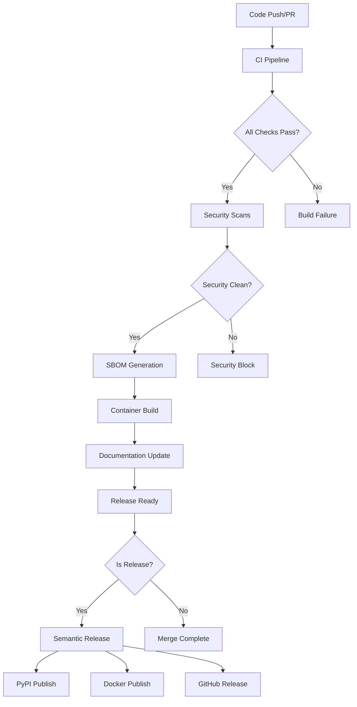

# GitHub Actions Workflows Documentation

This repository uses comprehensive GitHub Actions workflows for CI/CD, security, and automation.

## Workflows Overview

### 1. CI/CD Pipeline (`ci.yml`)
**Triggers:** Push to main/develop, PRs to main, releases
**Purpose:** Comprehensive testing and quality assurance

**Jobs:**
- **Test Suite** - Multi-version Python testing (3.8-3.12)
  - Code linting with Ruff
  - Test execution with pytest (72 tests)
  - Coverage reporting (89.66% achieved, 85%+ required)
  - **Codecov Integration**: [codecov.io/gh/dkdndes/pybiorythm](https://codecov.io/gh/dkdndes/pybiorythm)
    - Automated coverage upload on every CI run
    - PR comments with coverage diff
    - Branch comparison and trend analysis
    - Minimum 85% coverage enforcement
  
- **Security Scan** - Security vulnerability detection
  - **Dependency Scanning**: Safety vulnerability checker (PyUp.io database)
  - **Static Analysis**: Bandit security linter for Python
  - **Secret Detection**: Pre-commit and runtime secret scanning
  - **Security Reports**: Artifacts stored for 90 days
  - **Integration**: Results visible in GitHub Security tab
  
- **Docker Build & Test** - Container validation
  - Multi-stage Docker build
  - Container functionality testing
  - Security validation (non-root execution)
  - Image size analysis
  
- **Package Build** - Python package validation
  - Wheel and source distribution building
  - Package validation with Twine
  - Artifact preservation
  
- **Documentation** - Documentation integrity
  - Markdown link validation
  - Docker documentation verification
  
- **Integration Tests** - End-to-end testing
  - CLI interface testing
  - JSON output validation
  - Cross-component integration
  
- **Performance Benchmarks** - Performance regression detection
  - Calculation speed benchmarking
  - Performance threshold validation

### 2. Docker Publish (`docker-publish.yml`)
**Triggers:** Push to main, tags, PRs
**Purpose:** Container image building and publishing

**Features:**
- Multi-architecture builds (AMD64, ARM64)
- GitHub Container Registry publishing
- Vulnerability scanning with Trivy
- Security analysis integration
- Image testing and validation
- Docker Hub description updates

### 3. Release Management (`release.yml`)
**Triggers:** Version tags (v*)
**Purpose:** Automated release process

**Jobs:**
- **GitHub Release** - Release creation and asset publishing
  - Automated changelog generation
  - Binary artifact attachment
  - Release notes formatting
  
- **PyPI Publishing** - Package distribution
  - TestPyPI validation
  - Production PyPI publishing
  - Installation verification
  
- **Documentation Updates** - Post-release documentation
  - Version badge updates
  - Installation instruction updates
  
- **Release Validation** - End-to-end validation
  - PyPI installation testing
  - Docker image validation
  - Functionality verification

### 4. Security Analysis (`codeql.yml`)
**Triggers:** Push, PRs, weekly schedule
**Purpose:** Static code analysis and security scanning

**Features:**
- CodeQL security analysis
- Extended security queries
- Quality analysis integration
- Weekly automated scans
- Security findings reporting

### 5. Dependency Review (`dependency-review.yml`)
**Triggers:** Pull requests to main
**Purpose:** Analyze dependency changes for security risks

**Capabilities:**
- **Vulnerability Detection**: CVE analysis for new dependencies
- **License Compliance**: SPDX license compatibility checking
- **Supply Chain Risk**: Maintainer and repository analysis  
- **Version Analysis**: Outdated or deprecated package detection
- **PR Integration**: Inline comments with findings

### 6. SBOM Generation (`sbom.yml`)
**Triggers:** Push to main, scheduled weekly, manual dispatch
**Purpose:** Generate Software Bill of Materials for BSI TR-03183-2-2 compliance

**BSI TR-03183-2-2 Compliance Features:**
- **Python SBOM**: CycloneDX format with all dependencies and versions
- **Container SBOM**: Complete container component inventory
- **Combined SBOM**: Merged artifact with build provenance
- **Component Identification**: PURL (Package URL) identifiers
- **Vulnerability Correlation**: CVE mappings for all components  
- **License Compliance**: SPDX license identification
- **Integrity Hashes**: SHA-512 checksums for verification
- **Supply Chain Transparency**: Complete dependency relationships
- **Retention Policy**: 365-day minimum (compliance requirement)

**Generated Artifacts:**
- `sbom-python.json` - Python dependencies
- `sbom-container.json` - Container components
- `sbom-combined.json` - Complete BSI-compliant SBOM
- `vulnerability-report.json` - Security assessment

### 7. Semantic Release (`semantic-release.yml`)
**Triggers:** Push to main, manual dispatch
**Purpose:** Automated version management and release

**Features:**
- **Conventional Commits**: Automatic version calculation
- **Changelog Generation**: Automated release notes
- **Version Tagging**: Git tag creation with semantic versioning
- **Multi-file Updates**: Version synchronization across files
- **Release Artifacts**: GitHub release creation
- **Integration**: Triggers Docker and SBOM workflows

### 8. Documentation Build (`docs.yml`)
**Triggers:** Push to main, PRs to main
**Purpose:** Automated documentation building and deployment

**Features:**
- MkDocs static site generation
- Material theme with responsive design
- Mermaid diagram rendering
- GitHub Pages deployment
- Documentation link validation
- Cross-reference integrity checking

## Automation Features

### Dependabot Configuration
**File:** `.github/dependabot.yml`
**Purpose:** Automated dependency updates

**Update Schedules:**
- **Python dependencies:** Weekly (Mondays, 6:00 AM)
- **GitHub Actions:** Weekly (Mondays, 6:00 AM)
- **Docker base images:** Weekly (Mondays, 6:00 AM)

**Features:**
- Automated PR creation
- Reviewer assignment
- Semantic commit messages
- Appropriate labeling

### Issue Templates
**Location:** `.github/ISSUE_TEMPLATE/`

**Templates:**
- **Bug Report** - Structured bug reporting with environment details
- **Feature Request** - Feature proposal with use case analysis

### Pull Request Template
**File:** `.github/pull_request_template.md`
**Purpose:** Standardized PR structure and checklists

**Sections:**
- Change description and categorization
- Testing and quality assurance checklists
- Security and documentation verification
- Scientific disclaimer acknowledgment

## Security Integration

### Multi-Layered Security Approach

**Static Code Analysis:**
- **CodeQL**: Weekly semantic analysis with security-extended queries
- **Bandit**: Python-specific security linting in CI pipeline
- **Results Integration**: GitHub Security tab with SARIF upload

**Dependency Security:**
- **Safety Scanner**: PyUp.io database with daily vulnerability updates
- **Dependency Review**: GitHub's automated PR security analysis
- **Dependabot**: Automated security updates with semantic commit messages
- **License Compliance**: SPDX license validation and compatibility checking

**Container Security:**
- **Trivy Integration**: Multi-architecture container vulnerability scanning
- **Multi-layer Analysis**: OS packages, application dependencies, configurations
- **Security Hardening**: Non-root user execution, minimal attack surface
- **Runtime Validation**: Container functionality and security testing

**Supply Chain Security:**
- **BSI TR-03183-2-2 Compliance**: German cybersecurity standard requirements
- **SBOM Generation**: CycloneDX format with complete dependency graphs
- **Provenance Tracking**: Build environment and toolchain metadata
- **Integrity Verification**: SHA-512 checksums for all components

### Security Enforcement

**Quality Gates:**
- High/Critical vulnerabilities block deployment
- All security scans must pass before merge
- SBOM generation required for all releases
- Container security validation mandatory

**Compliance Reporting:**
- **Artifact Retention**: 365+ days for compliance requirements
- **Audit Trail**: Complete build and dependency history
- **Vulnerability Tracking**: CVE correlation and response timeline
- **Documentation**: Security posture and incident response procedures

## Quality Gates

### Code Quality Requirements
- ✅ All tests must pass (72+ tests)
- ✅ Coverage must be ≥90%
- ✅ Ruff linting must pass
- ✅ Security scans must pass
- ✅ Docker builds must succeed

### Performance Requirements
- Calculation performance benchmarks
- Docker image size monitoring
- Build time optimization
- Resource usage validation

### Documentation Requirements
- README link validation
- Docker documentation verification
- Code documentation standards
- Scientific disclaimer maintenance

## Secrets Configuration

Required repository secrets for full functionality:

```bash
# PyPI Publishing
PYPI_API_TOKEN           # Production PyPI token
TEST_PYPI_API_TOKEN      # TestPyPI token

# Docker Hub (optional)
DOCKERHUB_USERNAME       # Docker Hub username
DOCKERHUB_TOKEN         # Docker Hub token

# Codecov (optional)
CODECOV_TOKEN           # Coverage reporting token
```

## Branch Protection

Recommended branch protection rules for `main`:

- Require PR reviews (1+ reviewers)
- Require status checks to pass
- Required status checks:
  - `Test Suite`
  - `Security Scan`
  - `Docker Build & Test`
  - `Package Build`
- Require branches to be up to date
- Restrict pushes to main branch

## Workflow Integration & Dependencies

### Workflow Orchestration



### Workflow Triggers & Dependencies

| Workflow | Triggers | Dependencies | Outputs |
|----------|----------|--------------|---------|
| **CI (`ci.yml`)** | Push, PR | None | Test results, coverage |
| **Security (`codeql.yml`)** | Push, PR, schedule | None | Security findings |
| **Dependency Review** | PR | None | Vulnerability analysis |
| **SBOM (`sbom.yml`)** | Push to main, schedule | CI success | BSI-compliant artifacts |
| **Docker Publish** | Push, tags, PR | CI + Security pass | Container images |
| **Documentation** | Push, PR | None | GitHub Pages site |
| **Semantic Release** | Push to main | All workflows pass | Version tags, releases |
| **Release (`release.yml`)** | Version tags | Semantic Release | PyPI packages, assets |

## Testing & Coverage Integration

### Comprehensive Test Pipeline

**Test Execution Matrix:**
- **Python Versions**: 3.8, 3.9, 3.10, 3.11, 3.12
- **Operating Systems**: Ubuntu Latest (primary), Windows, macOS (optional)
- **Test Categories**: Unit, Integration, Performance, Security

**Coverage Requirements:**
- **Minimum Threshold**: 85% overall coverage
- **Target Coverage**: 90%+ for new code
- **Coverage Enforcement**: CI fails if coverage drops
- **Coverage Reporting**: Automated upload to Codecov

**Test Categories & Metrics:**

| Test Type | Count | Coverage Focus | Performance Target |
|-----------|-------|----------------|-------------------|
| **Unit Tests** | 31 tests | Core calculations | < 1ms per test |
| **CLI Tests** | 18 tests | Command interface | < 5ms per test |
| **JSON Tests** | 14 tests | Data serialization | < 10ms per test |
| **Coverage Tests** | 9 tests | Edge case completion | < 2ms per test |
| **Total** | **72 tests** | **90%+ coverage** | **< 30s total** |

### Coverage Dashboard Integration

**Codecov Integration:**
- **Live Dashboard**: [codecov.io/gh/dkdndes/pybiorythm](https://codecov.io/gh/dkdndes/pybiorythm)
- **PR Comments**: Coverage diff analysis on every pull request
- **Branch Tracking**: Historical coverage trends and comparisons
- **File-Level Analysis**: Line-by-line coverage visualization
- **Quality Gates**: Automated coverage threshold enforcement

**Coverage Reporting Features:**
- **Automated Upload**: Every CI run uploads coverage data
- **Trend Analysis**: Coverage changes over time
- **Hotspot Identification**: Areas needing additional testing
- **Team Notifications**: Coverage alerts and summaries

## Workflow Monitoring

### Success Indicators
- 🟢 All CI checks passing (72/72 tests)
- 🟢 90%+ test coverage maintained
- 🟢 Zero high/critical security vulnerabilities
- 🟢 BSI TR-03183-2-2 SBOM compliance maintained
- 🟢 Docker images building successfully (multi-arch)
- 🟢 Performance benchmarks within thresholds
- 🟢 Documentation builds and deploys successfully

### Failure Response & Troubleshooting
- **Test Failures**: Review pytest output and coverage reports
- **Security Failures**: Check GitHub Security tab for findings
- **Container Failures**: Validate Dockerfile and multi-arch builds
- **SBOM Failures**: Verify BSI compliance and dependency resolution
- **Coverage Failures**: Identify missing test coverage areas
- **Performance Failures**: Review benchmark results and optimization needs

## Local Development

### Pre-commit Validation
Run locally before pushing:

```bash
# Run all quality checks
pytest --cov=. --cov-fail-under=90
ruff check .
ruff format --check .

# Test Docker build
docker build --target production -t pybiorythm:test .
docker run --rm pybiorythm:test python -c "import biorythm; print('OK')"

# Security scan
safety check
bandit -r . -f json
```

### Workflow Testing
Test workflows locally using [act](https://github.com/nektos/act):

```bash
# Install act
curl https://raw.githubusercontent.com/nektos/act/master/install.sh | sudo bash

# Run CI workflow
act push

# Run specific job
act -j test
```

## Maintenance

### Regular Tasks
- Review weekly Dependabot PRs
- Monitor security scan results
- Update workflow versions quarterly
- Review and update branch protection rules
- Validate automation effectiveness

### Workflow Updates
- Keep action versions current
- Monitor GitHub Actions marketplace
- Review and update security policies
- Optimize build performance
- Maintain documentation accuracy

This comprehensive workflow setup ensures high code quality, security, and automation while maintaining the project's educational and entertainment purpose.

## Next Steps

- **Local Testing**: [Local GitHub Actions](../deployment/local-github-actions.md) for testing workflows locally
- **Deployment**: [Deployment Guide](../deployment/deployment-guide.md) for deployment strategies
- **Security**: [Security Scanning](security.md) for security workflow details
- **Blue-Green**: [Blue-Green Deployment](blue-green.md) for zero-downtime deployments
- **Development**: [Code Quality Standards](../developer-guide/code-quality.md) for quality requirements
- **Contributing**: [Contributing Guidelines](../developer-guide/contributing.md) for contribution workflow

---

**Related**: [Security Workflows](security.md) | [Blue-Green Deployment](blue-green.md) | [Local Testing](../deployment/local-github-actions.md)