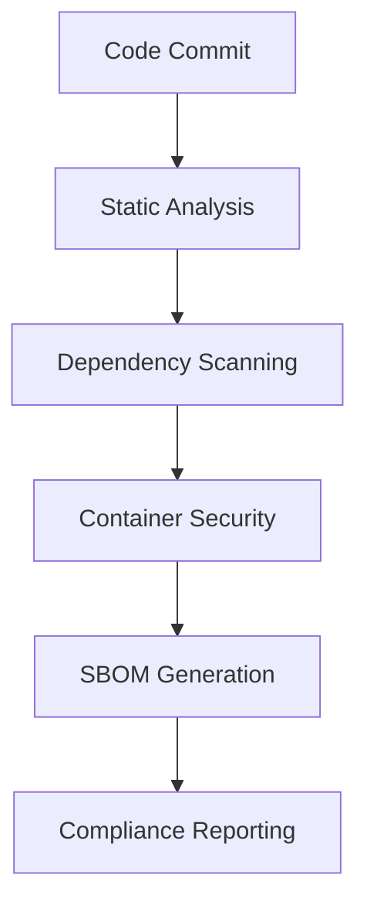

# Security Workflows

PyBiorythm implements comprehensive security scanning and compliance workflows throughout the CI/CD pipeline.

## Security Pipeline Overview



## Workflow Components

### 1. CodeQL Security Analysis
**File**: `.github/workflows/codeql.yml`

- **Triggers**: Push to main/develop, PRs, weekly schedule
- **Analysis**: Python code for vulnerabilities
- **Detects**: SQL injection, XSS, path traversal, etc.
- **Integration**: GitHub Security tab

```yaml
- name: Analyze with CodeQL
  uses: github/codeql-action/analyze@v2
  with:
    languages: python
```

### 2. Dependency Vulnerability Scanning
**Integrated in**: `.github/workflows/ci.yml` (Security job)

#### Safety Check
```bash
uv run safety check --json
```
- Scans Python dependencies for known vulnerabilities
- Uses PyUp.io vulnerability database
- Fails build on High/Critical vulnerabilities

#### Dependabot Integration
- Automated vulnerability detection
- Automatic security update PRs
- Weekly dependency updates

### 3. Static Security Analysis
**Tool**: Bandit security linter

```bash
uv run bandit -r biorythm/ main.py -f json -o bandit-report.json
```

**Checks for**:
- Hardcoded passwords/secrets
- Insecure cryptographic practices
- SQL injection vulnerabilities  
- Path traversal issues
- Use of insecure functions

### 4. Container Security
**File**: Docker builds in multiple workflows

#### Multi-stage Build Security
```dockerfile
# Builder stage - contains build tools
FROM python:3.12-slim AS builder

# Production stage - minimal attack surface
FROM python:3.12-slim AS production
USER biorythm  # Non-root execution
```

#### Container Scanning
- **Trivy**: Vulnerability scanning
- **Non-root execution**: Security hardening
- **Minimal base images**: Reduced attack surface

### 5. SBOM Generation
**File**: `.github/workflows/sbom.yml`

**BSI TR-03183-2-2 Compliance**:
- Python dependencies SBOM
- Container components SBOM  
- Combined compliance SBOM
- Cryptographic integrity hashes

```bash
# Generate CycloneDX SBOM
uv run cyclonedx-py requirements requirements-freeze.txt \
  --output-format json \
  --output-file sbom-python.json
```

## Security Metrics & Monitoring

### Current Security Posture

| Metric | Status | Target |
|--------|--------|---------|
| **Critical Vulnerabilities** | 0 | 0 |
| **High Vulnerabilities** | 0 | 0 |
| **SBOM Compliance** | BSI TR-03183-2-2 ✅ | Maintained |
| **Container Security** | Hardened ✅ | Non-root + minimal |
| **Dependency Freshness** | 95%+ ✅ | > 90% |

### Security Gates

**Pre-merge Requirements**:
- ✅ CodeQL analysis passes
- ✅ No High/Critical vulnerabilities
- ✅ Bandit security scan clean
- ✅ Container security validated
- ✅ SBOM generation successful

## Security Incident Response

### Vulnerability Response Timeline
- **Critical (9.0-10.0)**: 24 hours
- **High (7.0-8.9)**: 72 hours  
- **Medium (4.0-6.9)**: 2 weeks
- **Low (0.1-3.9)**: Next release cycle

### Emergency Security Process
```bash
# 1. Create security branch
git checkout -b security/CVE-XXXX-XXXXX

# 2. Apply security patch
# (implement fix)

# 3. Security validation
uv run pytest tests/security/
uv run bandit -r biorythm/ main.py
uv run safety check

# 4. Emergency release
git commit -m "security: fix CVE-XXXX-XXXXX"
# Create emergency PR and release
```

## Security Configuration

### Branch Protection
**Main Branch Security**:
- Required security scan passes
- Required status checks
- No admin bypass
- Dismiss stale reviews

### Secrets Management
```yaml
# GitHub Secrets (encrypted)
secrets:
  CODECOV_TOKEN: ${{ secrets.CODECOV_TOKEN }}
  DOCKER_PASSWORD: ${{ secrets.DOCKER_PASSWORD }}
```

**Security Measures**:
- ✅ No secrets in code/logs
- ✅ Encrypted storage
- ✅ Least-privilege access
- ✅ Regular rotation
- ✅ Secret scanning enabled

### Artifact Security
**SBOM Retention**:
- SBOM files: 365 days (compliance)
- Vulnerability reports: 90 days
- Security scans: 30 days

## Security Tools Integration

### GitHub Security Features
- [x] **Dependency Graph**: Vulnerability tracking
- [x] **Dependabot Alerts**: Automated detection  
- [x] **Code Scanning**: CodeQL integration
- [x] **Secret Scanning**: Credential protection
- [x] **Push Protection**: Prevents secret commits

### External Tools
- **Safety**: Python dependency scanner
- **Bandit**: Python security linter
- **Trivy**: Container vulnerability scanner  
- **CycloneDX**: SBOM generation

## Monitoring & Alerts

### Security Dashboard
**GitHub Security Tab**: https://github.com/dkdndes/pybiorythm/security

**Alert Channels**:
- GitHub Security notifications
- Email alerts for Critical/High
- PR comments for new vulnerabilities
- Build failures on security issues

### Audit Trail
```
audit-trail/
├── security-scans/       # Historical scan results
├── sbom-history/        # BSI compliance records  
├── vulnerability-reports/ # Security assessments
└── incident-responses/   # Security event logs
```

---

**Related**: [GitHub Actions](github-actions.md) | [Blue-Green Deployment](blue-green.md) | [Deployment Security](../deployment/security.md)